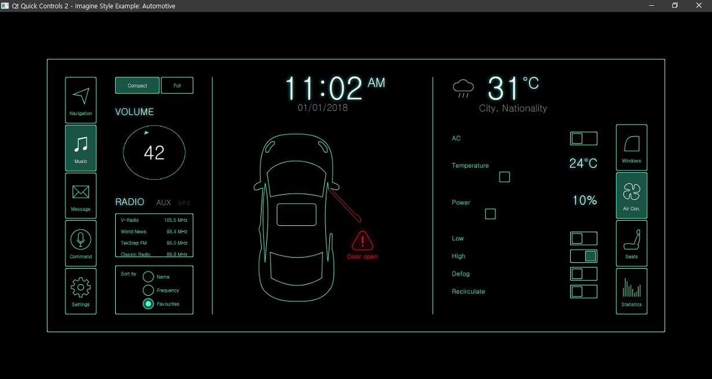

# Qt automotive

- Qt automotive is a example of Qt.

## Tech.

- Qt QML
	- QtQuick 2.12
	- QtQuick.Layouts 1.12
	- QtQuick.Controls 2.12
	- QtQuick.Controls.Imagine 2.12
	- QtQuick.Window 2.0
	- QtGraphicalEffects 1.12

## License
- This example is part of the examples of the Qt Toolkit. : Copyright (c) The Qt Company Ltd.
- Some code is fixed by j2doll.
